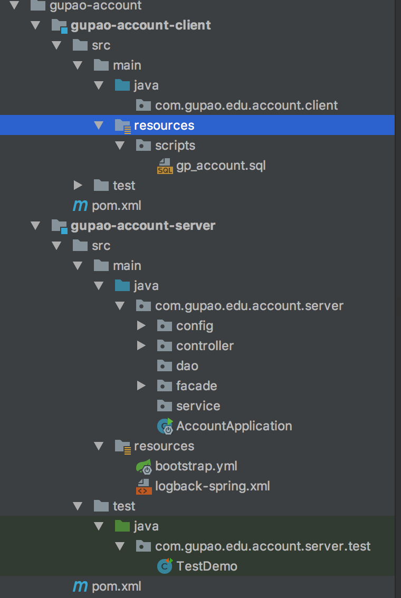
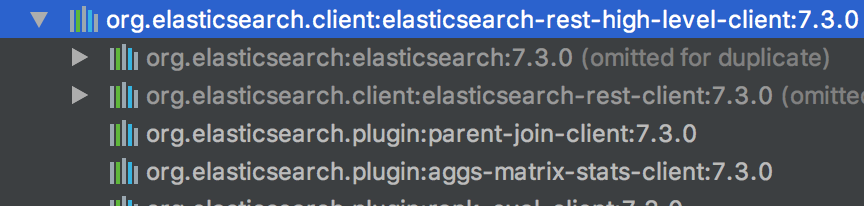

# app-backend

#### 目录结构介绍
##### 子项目说明

* gupao-common项目为通用工具包，**后续开发过程中遇到的工具类统一加入这个项目中（根据类型创建包）**，目前包括redis工具类、全局异常处理、所有controller通用返回对象(Result<T>)、通用feign fallback拦截器等。
* 所有的 gupao-{模块}-client项目为 业务模块对外提供的依赖，比如POJO或者EntityBean，
    * *.client.facade包放置所有使用@FeignClient的类（需根据细分业务创建子包）
    * *.client.facade.fallback包放置 @FeignClient 中自定义的fallbak 和 fallbackFactory类（common中已经对fallback做了通用拦截，需要特殊实现时添加自己的fallback实现，默认不进行fallback属性配置时会调用通用的fallback实现,同样需根据细分业务创建子包）

* 所有的 gupao-{模块}-server项目为 业务模块对外提供的远程服务，提供restful接口。
  * 基础服务为gupao-lotus ，为基础服务模块，主要包括第三方登录、搜索引擎索引维护、云视频维护、短信、邮件、阿里oss、支付、任务调度等。

##### 项目package说明

如图：

###### gupao-*-client项目

* POJO或者EntityBean放到 com.gupao.edu.{模块}.client包下（根据细分业务创建子包），我们约定对普通的JavaBean统一使用到lombok进行getter、setter、toString()方法的生成(注意，使用lombok需要设置无参构造和全部参数构造)
* sql脚本统一放入gupao-{模块}-client项目中的 classpath：resources/scripts目录下。
  * 每个模块统一放到一个sql文件中，建表语句对表和字段进行注释。

###### gupao-*-server项目

* config包放置所有使用@Configuration的类（需根据细分业务创建子包）
* controller包放置所有使用@RestController的类（需根据细分业务创建子包）
* service包中放置controller调用的具体实现，约定service使用接口加实现的风格。（需根据细分业务创建子包）
* resources/mapper目录存放所有的mybatis 配置类（需根据细分业务创建子目录）

###### 添加依赖

* 需要添加依赖时，项目版本统一在gupao-parent项目的pom文件中添加版本号变量，子项目的版本号不要直接写版本。

* 依赖传递的，只写最上层的依赖包，如下图，只依赖 `elasticsearch-rest-high-level-client` ，不需要再依赖 `elasticsearch`。

 
 
 ##### mysql逆向工程
 * gupao-reverse项目用于做逆向，生成的代码在reverse包中，需要copy到自己的项目中。
 * 该项目account文件夹下有示例，可以参考。